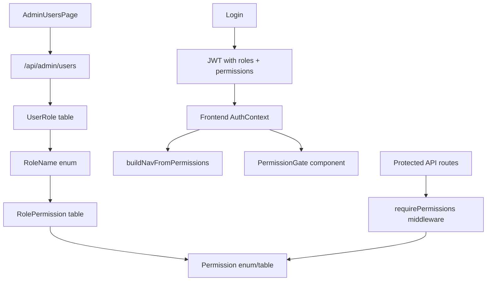

# Admin Permissions System — Code Plan

> **Status:** Planning only — no code changes yet.
>
> **Goal:** Add an admin page where authorized admins can assign access to users. Every user sees navigation and UI options that match their effective permissions.

---

## 1. Current state

Today OPS-OS uses **role-based access control (RBAC)** with a flat `RoleName` enum. There is **no permissions table** and **no admin UI** for user management.

### What exists today

| Layer | How it works |
|-------|--------------|
| **Database** | `User` → `UserRole` (many roles per user) |
| **Backend** | `requireRoles(...)` middleware + `hasRole()` in services |
| **Frontend** | Hard-coded routes per role in `App.tsx`; static sidebars per dashboard |
| **Provisioning** | Seed script + manual DB edits; new Google users get `MAPPING_INSPECTOR` |

### Key files (today)

```
backend/prisma/schema.prisma          # RoleName enum, User, UserRole
backend/src/middleware/auth.ts        # JWT, requireRoles()
backend/src/domain/roles.ts           # isOpsManagerRole, etc.
backend/src/routes/auth.ts            # login only — no user admin API
frontend/src/App.tsx                  # RoleRoute guards per dashboard
frontend/src/pages/DashboardPage.tsx  # Redirect by role priority
frontend/src/components/*/Sidebar.tsx # Static NAV_ITEMS per role
```

### Gaps

- No API to list users, assign roles, or manage permissions
- Navigation is **hard-coded** — adding/removing a role requires code changes
- Users with **multiple roles** only land on one dashboard (first match in priority order)
- No audit trail when access changes

---

## 2. Recommended approach

Use **RBAC with permissions** — not raw per-user permission picking for everything.

```
User ──► UserRole ──► Role ──► RolePermission ──► Permission
                              └── optional ──► UserPermission (overrides only)
```

### Why this model

| Approach | Verdict |
|----------|---------|
| Assign roles only (Phase 1) | Good MVP — admin picks roles, nav derived from roles |
| Assign individual permissions only | Too granular to manage for 50+ users |
| Roles + permissions (recommended) | Roles are presets; permissions drive nav and API guards |

### Default decisions (can change before implementation)

- **Admin access:** `OPS_ADMIN` only (can expand to `OPS_MANAGER_2` later)
- **Phase 1:** Admin UI assigns **roles**; permissions are mapped to roles in code/DB
- **Phase 2:** Optional per-user permission overrides for exceptions
- **Nav:** Built dynamically from the user's effective permission set

---

## 3. Target architecture



### Effective permissions (computed)

```
effectivePermissions(user) =
  permissions from all assigned roles
  ∪ optional user-level overrides
  − optional user-level denials (Phase 2)
```

---

## 4. Database schema changes

### Phase 1 — keep roles, add permission mapping

```prisma
enum Permission {
  // Maps / workflow
  MAPS_VIEW
  MAPS_ASSIGN_INSPECTOR
  MAPS_ASSIGN_QA
  MAPS_INSPECTOR_STATUS
  MAPS_QA_REVIEW
  MAPS_UPLOAD_REVIEW
  MAPS_FIELD_UPDATE
  MAPS_HUB_VIEW
  MAPS_HUB_MANAGE
  MAPS_HISTORY
  MAPS_IMPORT_CSV
  MAPS_SYNC_SPREADSHEET

  // Team / ops
  TEAM_VIEW
  REPORTS_VIEW
  AVAILABILITY_VIEW
  AVAILABILITY_MANAGE
  SHIFT_PLAN_MANAGE

  // Admin
  USERS_MANAGE
  ROLES_MANAGE
}

model RolePermission {
  id         String     @id @default(cuid())
  role       RoleName
  permission Permission

  @@unique([role, permission])
}

// UserRole stays as-is — admin assigns roles, permissions come from RolePermission
```

### Phase 2 — optional user overrides (only if needed)

```prisma
model UserPermission {
  id         String     @id @default(cuid())
  userId     String
  permission Permission
  granted    Boolean    @default(true)  // true = grant, false = deny override
  user       User       @relation(fields: [userId], references: [id], onDelete: Cascade)

  @@unique([userId, permission])
}
```

### Seed data

- Seed `RolePermission` rows mapping each existing `RoleName` to the permissions that role already has in code today
- Example: `GRAPHIC_QA` → `[MAPS_VIEW, MAPS_QA_REVIEW, MAPS_UPLOAD_REVIEW]`
- Example: `OPS_ADMIN` → all ops permissions + `USERS_MANAGE`, `ROLES_MANAGE`

---

## 5. Permission catalog (initial mapping)

Map existing behavior 1:1 before adding new capabilities.

| Role | Permissions |
|------|-------------|
| `GRAPHIC_TEAM_LEADER` | `MAPS_*` (leader subset), `TEAM_VIEW`, `MAPS_HISTORY`, `MAPS_IMPORT_CSV` |
| `MAPPING_INSPECTOR` | `MAPS_VIEW`, `MAPS_INSPECTOR_STATUS` |
| `GRAPHIC_QA` | `MAPS_VIEW`, `MAPS_QA_REVIEW`, `MAPS_UPLOAD_REVIEW` |
| `SUPERVISOR` | `MAPS_VIEW`, `MAPS_FIELD_UPDATE`, `MAPS_HUB_VIEW`, `AVAILABILITY_VIEW` |
| `SUPERVISOR_SHIFT_LEADER` | supervisor set + hub manage actions |
| `OPS_ADMIN` / `OPS_MANAGER_2` | ops hub, reports, availability, shift plan, spreadsheet sync, `USERS_MANAGE` |

Full mapping table to be finalized during implementation by auditing `requireRoles()` calls in:

- `backend/src/routes/maps.ts`
- `backend/src/routes/reports.ts`
- `backend/src/routes/availability.ts`

---

## 6. Backend changes

### 6.1 New domain module

**File:** `backend/src/domain/permissions.ts`

```typescript
export function permissionsForRoles(roles: RoleName[]): Permission[]
export function hasPermission(user: AuthUser, ...perms: Permission[]): boolean
export function requirePermissions(...perms: Permission[])  // middleware
```

### 6.2 Auth payload

Extend JWT + `/api/auth/me` to include `permissions: Permission[]` (computed server-side, not stored in JWT long-term if we want instant revocation — see note below).

**Option A (simpler):** Include permissions in JWT; user re-logins to pick up changes.

**Option B (better):** JWT has roles only; `/api/auth/me` and middleware reload permissions from DB each request (matches current role reload pattern).

**Recommendation:** Option B — keep JWT as roles, compute permissions on each request (same as today for roles).

### 6.3 New admin API

**File:** `backend/src/routes/admin/users.ts`

| Method | Path | Permission | Action |
|--------|------|------------|--------|
| `GET` | `/api/admin/users` | `USERS_MANAGE` | List all users with roles |
| `GET` | `/api/admin/users/:id` | `USERS_MANAGE` | Get one user |
| `PATCH` | `/api/admin/users/:id/roles` | `ROLES_MANAGE` | Set roles `{ roles: RoleName[] }` |
| `GET` | `/api/admin/roles` | `ROLES_MANAGE` | List roles + their permissions |
| `GET` | `/api/admin/permissions` | `ROLES_MANAGE` | List all permissions (for UI labels) |

**Validation rules:**

- Admin cannot remove their own `USERS_MANAGE` / last admin role (prevent lockout)
- At least one user must retain `OPS_ADMIN` + `USERS_MANAGE`
- Log role changes to a new `AccessAuditEvent` table (optional Phase 1.5)

### 6.4 Migrate route guards (incremental)

Replace `requireRoles(...)` with `requirePermissions(...)` over time:

```typescript
// Before
router.post("/:id/assign", requireRoles(RoleName.GRAPHIC_TEAM_LEADER), ...)

// After
router.post("/:id/assign", requirePermissions(Permission.MAPS_ASSIGN_INSPECTOR), ...)
```

Keep `requireRoles` as a thin wrapper during migration:

```typescript
requireRolesForPermissions(Permission.MAPS_ASSIGN_INSPECTOR)
// internally maps permission → allowed roles OR checks permission directly
```

### 6.5 Service layer

Update `getMapForUser`, `listMapsForUser`, etc. in `workflow.ts` to use `hasPermission()` where appropriate, not just role checks.

---

## 7. Frontend changes

### 7.1 Auth context

**File:** `frontend/src/context/AuthContext.tsx`

Add to user state:

```typescript
interface User {
  // existing fields
  roles: RoleName[];
  permissions: Permission[];  // from /api/auth/me
}

function hasPermission(user: User, ...perms: Permission[]): boolean
```

### 7.2 Navigation registry

**File:** `frontend/src/lib/navigation.ts`

Single source of truth — nav items declare required permissions:

```typescript
export const NAV_ITEMS: NavItem[] = [
  {
    id: "leader-maps",
    label: "Maps",
    href: "/app/leader/maps",
    permissions: [Permission.MAPS_VIEW, Permission.MAPS_ASSIGN_INSPECTOR],
    group: "leader",
  },
  {
    id: "ops-hub",
    label: "Hub",
    href: "/app/ops/hub",
    permissions: [Permission.MAPS_HUB_VIEW],
    group: "ops",
  },
  // ...
];

export function buildNavForUser(user: User): NavItem[] {
  return NAV_ITEMS.filter(item =>
    item.permissions.some(p => user.permissions.includes(p))
  );
}
```

### 7.3 Unified sidebar (Phase 2 UI refactor)

Replace three separate sidebars with one `AppSidebar` driven by `buildNavForUser()`.

**Phase 1 shortcut:** Keep existing sidebars but filter `NAV_ITEMS` arrays by permission.

### 7.4 Route guards

**File:** `frontend/src/App.tsx`

```typescript
function PermissionRoute({ permissions, children }) {
  const { user } = useAuth();
  if (!user || !hasPermission(user, ...permissions)) {
    return <Navigate to="/app" replace />;
  }
  return children;
}
```

### 7.5 Dashboard redirect for multi-role users

**File:** `frontend/src/pages/DashboardPage.tsx`

Instead of single-role priority, show a **workspace picker** when user has access to multiple nav groups:

```
"You have access to: [Leader workspace] [OPS workspace] [Inspector inbox]"
```

Or default to highest-priority + show switcher in header.

### 7.6 Admin page (new)

**Route:** `/app/admin/users`

**Guard:** `Permission.USERS_MANAGE`

**File:** `frontend/src/pages/AdminUsersPage.tsx`

**UI sections:**

1. **User list** — name, email, current roles, last login (optional)
2. **Role editor** — checkboxes for each `RoleName` with human labels
3. **Effective permissions preview** — read-only list showing what the selected roles grant
4. **Save** — calls `PATCH /api/admin/users/:id/roles`

**Wire into ops sidebar** (or separate admin sidebar):

```typescript
{ label: "User access", href: "/app/admin/users", permission: Permission.USERS_MANAGE }
```

### 7.7 Conditional UI components

**File:** `frontend/src/components/common/PermissionGate.tsx`

```tsx
<PermissionGate permissions={[Permission.MAPS_ASSIGN_INSPECTOR]}>
  <AssignInspectorButton />
</PermissionGate>
```

Use in `MapDetailPage.tsx` and action buttons instead of scattered `hasRole()` checks.

---

## 8. Implementation phases

### Phase 1 — Admin role assignment (MVP)

**Goal:** Admin can assign roles via UI; existing behavior preserved.

| Step | Work |
|------|------|
| 1 | Add `Permission` enum + `RolePermission` table + seed mappings |
| 2 | Add `permissions.ts` domain module + include permissions in `/api/auth/me` |
| 3 | Add admin users API (`GET/PATCH` roles) |
| 4 | Build `AdminUsersPage` |
| 5 | Add nav link for admins |
| 6 | Test with demo users |

**Deliverable:** OPS Admin can open Admin → Users, toggle roles, user re-login sees correct dashboard.

### Phase 2 — Dynamic navigation

| Step | Work |
|------|------|
| 1 | Create `navigation.ts` registry |
| 2 | Filter sidebars by permissions |
| 3 | Multi-role workspace switcher |
| 4 | Replace `RoleRoute` with `PermissionRoute` on key routes |

**Deliverable:** User with Leader + Inspector roles sees both workspaces.

### Phase 3 — Permission-based API guards

| Step | Work |
|------|------|
| 1 | Audit all `requireRoles()` calls |
| 2 | Replace with `requirePermissions()` |
| 3 | Update service-layer checks |
| 4 | Remove deprecated role-only guards |

**Deliverable:** Backend fully driven by permissions; roles are just assignment presets.

### Phase 4 — Optional overrides + audit

| Step | Work |
|------|------|
| 1 | `UserPermission` table for exceptions |
| 2 | `AccessAuditEvent` for role change history |
| 3 | Admin UI for per-user permission toggles (advanced tab) |

---

## 9. Files to create / modify

### New files

```
backend/src/domain/permissions.ts
backend/src/routes/admin/users.ts
backend/prisma/migrations/XXXX_permissions/migration.sql
backend/prisma/seed/role-permissions.ts
frontend/src/lib/navigation.ts
frontend/src/lib/permissions.ts
frontend/src/pages/AdminUsersPage.tsx
frontend/src/components/admin/UserRoleEditor.tsx
frontend/src/components/common/PermissionGate.tsx
docs/admin-permissions-plan.md   ← this file
```

### Modified files

```
backend/prisma/schema.prisma
backend/src/middleware/auth.ts
backend/src/routes/auth.ts          # /me returns permissions
backend/src/index.ts                # mount /api/admin
backend/src/routes/maps.ts          # migrate guards (Phase 3)
backend/src/services/workflow.ts
frontend/src/App.tsx
frontend/src/context/AuthContext.tsx
frontend/src/api.ts
frontend/src/pages/DashboardPage.tsx
frontend/src/components/ops/OpsManagerSidebar.tsx   # add Admin link
frontend/src/pages/MapDetailPage.tsx              # PermissionGate
```

---

## 10. API examples

### GET /api/admin/users

```json
[
  {
    "id": "clx...",
    "name": "David Levi",
    "email": "inspector@ops-demo.local",
    "roles": ["MAPPING_INSPECTOR"],
    "permissions": ["MAPS_VIEW", "MAPS_INSPECTOR_STATUS"]
  }
]
```

### PATCH /api/admin/users/:id/roles

**Request:**

```json
{ "roles": ["MAPPING_INSPECTOR", "GRAPHIC_QA"] }
```

**Response:**

```json
{
  "id": "clx...",
  "roles": ["MAPPING_INSPECTOR", "GRAPHIC_QA"],
  "permissions": ["MAPS_VIEW", "MAPS_INSPECTOR_STATUS", "MAPS_QA_REVIEW", "MAPS_UPLOAD_REVIEW"]
}
```

### GET /api/auth/me (updated)

```json
{
  "user": {
    "id": "clx...",
    "email": "ops@ops-demo.local",
    "name": "Rachel Ops",
    "roles": ["OPS_ADMIN"],
    "permissions": ["MAPS_HUB_VIEW", "USERS_MANAGE", "..."]
  }
}
```

---

## 11. Testing plan

| Test | Expected |
|------|----------|
| Non-admin hits `/api/admin/users` | 403 |
| Admin assigns QA role to inspector | User can access `/app/qa` after re-login |
| Admin removes all roles | User sees "No workspace" page |
| Admin removes own USERS_MANAGE | Blocked with error |
| User with 2 roles | Sees both nav groups (Phase 2) |
| API action without permission | 403 even if UI hidden |
| Seed + migration on fresh DB | RolePermission rows match current behavior |

---

## 12. Open decisions (confirm before coding)

1. **Who is admin?** Default: `OPS_ADMIN` only. Include `OPS_MANAGER_2`?
2. **Instant permission refresh?** Re-login required vs WebSocket push to force refresh?
3. **Per-user permission overrides in MVP?** Recommend Phase 4 only.
4. **Separate `/app/admin` route tree?** Or a section inside ops dashboard?
5. **Google SSO auto-provisioning:** Keep default `MAPPING_INSPECTOR` or no roles until admin assigns?

---

## 13. Summary

| What | Plan |
|------|------|
| Admin page | `/app/admin/users` — assign roles to users |
| User experience | Nav + buttons driven by effective permissions |
| Data model | Roles stay; permissions mapped via `RolePermission` |
| Migration | Phased — admin UI first, then dynamic nav, then API guards |
| No breaking changes in Phase 1 | Existing role checks keep working alongside new system |

**Next step after approval:** Implement Phase 1 (schema + seed + admin API + admin page).
