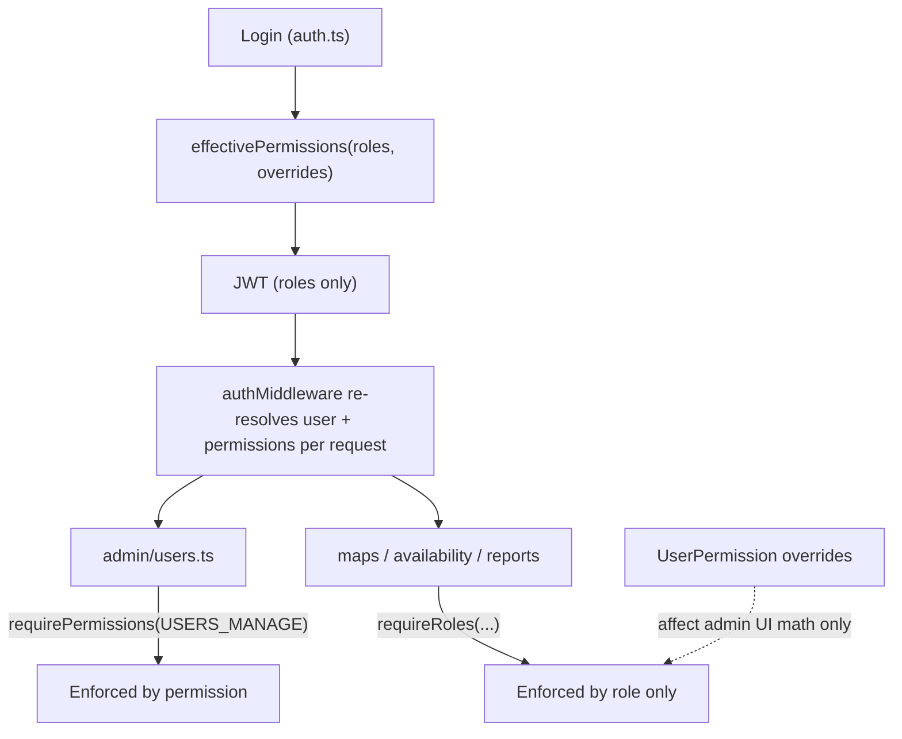

# OPS-OS Code Review & Roadmap — July 2026

A "stop and take stock" review of the OPS-OS codebase. The goal is to understand
what we have, be honest about what needs fixing and sharpening, and lay out a
phased roadmap for the work ahead. This document adds no application code — it is
a shared map of the terrain before we start the next round of work.

Reviewed branch: `feat-user`. Scope: `backend/`, `frontend/`, data model, tooling.

---

## 1. Executive summary

The product is functionally rich and the domain logic is well separated. The
biggest risks are not features — they are **safety nets**: the type-checker does
not pass, CI does not gate build/lint, the permission system is only half-wired,
and there is a stale duplicate of the whole repo on disk that has already cost us
real debugging time.

Health snapshot:

- Backend runtime: works (via `tsx`, which skips type-checking).
- Backend build (`tsc`): FAILS today.
- Frontend build (`tsc -b && vite build`): passes.
- Tests: pass, but coverage is thin (domain logic only; no route/component tests).
- CI: runs tests only, and only on feature branches — not `main`.

Top 5 risks (highest first):

1. Backend `tsc` build is broken — strict type safety is effectively off.
2. Permission system is half-adopted — overrides do not gate real API access.
3. Open Google signup when the email allowlist is unset.
4. No CI gate for build/lint/typecheck, and no ESLint/Prettier at all.
5. A stale duplicate repo copy at `/Users/OPS-OS/OPS-OS` causes "phantom" bugs.

---

## 2. What we have

### 2.1 Backend

Express 5 + Prisma 6 + TypeScript, cleanly layered:

- Entry: [backend/src/index.ts](backend/src/index.ts) — CORS, JSON parser, route mounting, HTTP + WebSocket server, daily-report scheduler.
- Routes (thin HTTP handlers): [backend/src/routes/auth.ts](backend/src/routes/auth.ts), [backend/src/routes/maps.ts](backend/src/routes/maps.ts), [backend/src/routes/availability.ts](backend/src/routes/availability.ts), [backend/src/routes/reports.ts](backend/src/routes/reports.ts), [backend/src/routes/admin/users.ts](backend/src/routes/admin/users.ts).
- Services (DB-backed business logic): [backend/src/services/workflow.ts](backend/src/services/workflow.ts) (~2,950 lines), plus availability, shift-plan, shift-change, daily-report, CSV import, spreadsheet sync.
- Domain (pure logic, no I/O): [backend/src/domain/permissions.ts](backend/src/domain/permissions.ts), roles, pipeline, activity feed, availability rules.
- Middleware: [backend/src/middleware/auth.ts](backend/src/middleware/auth.ts) — JWT sign/verify, per-request user resolution with a 30s cache, role guards.
- Lib: [backend/src/lib/env.ts](backend/src/lib/env.ts) (validated env), Prisma client + realtime extension, WS bus, shared types.

The domain/service/route separation is a real strength and worth protecting.

### 2.2 Frontend

React 19 + Vite 6 + Tailwind 4 + TanStack Query, ~95 files:

- Pages: role dashboards (Leader/Ops/Supervisor/Inspector/QA), login, map detail, admin.
- Components by domain: `ops/`, `leader/`, `supervisor/`, `hub/`, `availability/`, `workflow/`, `common/`.
- Hooks: React Query wrappers in [frontend/src/hooks/queries.ts](frontend/src/hooks/queries.ts), realtime bridge, section routing, polling.
- Context: a single [frontend/src/context/AuthContext.tsx](frontend/src/context/AuthContext.tsx).
- API client: monolithic [frontend/src/api.ts](frontend/src/api.ts) (~648 lines).

Positives: lazy-loaded role dashboards, section code-splitting, centralized query
keys, a single WebSocket bridge, and the heaviest business logic (`lib/`) is unit-tested.

### 2.3 Data model

Prisma schema at [backend/prisma/schema.prisma](backend/prisma/schema.prisma) is well-indexed for
map queries, events, and shift planning, with sequential migrations. Notable
modeling concerns are listed under Findings (attachments as base64, a few missing
indexes, untyped JSON report payloads).

### 2.4 The permission-enforcement gap

Permissions are computed correctly on every request but are only *enforced* on the
admin routes. Everything else still gates on roles, so per-user overrides never
affect real access:



The practical effect: an admin can grant or deny a permission in the Advanced tab,
the UI reflects it, but for non-admin routes the server still only checks roles.

---

## 3. Findings by area

Each item is tagged High / Medium / Low.

### 3.1 Security & correctness

- High — Permission system half-wired. `requirePermissions` is used only in [backend/src/routes/admin/users.ts](backend/src/routes/admin/users.ts) (line 19). All other routes use `requireRoles`, so `UserPermission` overrides never gate real API access. The admin route in [frontend/src/App.tsx](frontend/src/App.tsx) is guarded by `hasOpsManagerRole`, while the sidebar link in [frontend/src/components/ops/OpsManagerSidebar.tsx](frontend/src/components/ops/OpsManagerSidebar.tsx) gates on `USERS_MANAGE` — inconsistent semantics.
- High — Open Google signup. In [backend/src/routes/auth.ts](backend/src/routes/auth.ts) (lines ~52-70), when `ALLOWED_EMAIL_DOMAINS` is unset, any Google account auto-creates a `MAPPING_INSPECTOR` user. The domain check only applies to brand-new users.
- Medium/High — No rate limiting and no security headers. [backend/src/index.ts](backend/src/index.ts) mounts only `cors` + `express.json`. Auth, CSV import, and spreadsheet sync are unprotected; JSON body limit is 10MB.
- Medium — Stale auth cache. `invalidateUserCache` is defined in [backend/src/middleware/auth.ts](backend/src/middleware/auth.ts) but never called after admin role/permission mutations, so changes can lag up to the 30s TTL.
- Medium — WebSocket auth is weaker than HTTP. [backend/src/lib/realtime.ts](backend/src/lib/realtime.ts) only calls `verifyToken()` (no DB re-check), and the token is passed in the query string (leaks via logs/proxies).
- Medium — CORS always allows localhost origins, even in production ([backend/src/index.ts](backend/src/index.ts)).
- Medium — `DATABASE_URL` and `GOOGLE_CLIENT_ID` are optional in [backend/src/lib/env.ts](backend/src/lib/env.ts) with no production fail-fast (only `JWT_SECRET` is enforced).

### 3.2 Backend

- High — `tsc` build fails (see Appendix A). Dozens of `TS7006` implicit-any errors, concentrated in [backend/src/services/workflow.ts](backend/src/services/workflow.ts), plus Prisma type/enum export errors. Dev survives only because `tsx` does not type-check.
- Medium — No global error handler or `asyncHandler`. Per-route `try/catch` is copy-pasted ~40+ times in [backend/src/routes/maps.ts](backend/src/routes/maps.ts) alone, and HTTP status mapping is inconsistent (400 vs 403 vs 500 for similar failures).
- Medium — Raw error messages (`(e as Error).message`) are returned to clients, which can leak internals.
- Medium — Input validation is inconsistent. Zod is used for env and admin PATCH bodies only ([backend/src/routes/admin/users.ts](backend/src/routes/admin/users.ts)); most mutating routes cast request bodies with ad-hoc checks.
- Medium — Monolithic services. [backend/src/services/workflow.ts](backend/src/services/workflow.ts) (~2,950 lines) mixes map lifecycle, hub, swaps, and shift-leader checks.
- Low — `RolePermission` DB table is seed/display-only; runtime uses the hardcoded `ROLE_PERMISSIONS` map in [backend/src/domain/permissions.ts](backend/src/domain/permissions.ts) — drift risk. Some `@deprecated` endpoints/fields remain live.

### 3.3 Frontend

- High — Dashboard queries ignore errors. Pages destructure only `{ data, isLoading }` and never `isError`, so a failed fetch renders an empty board with no banner. See [frontend/src/pages/SupervisorDashboardPage.tsx](frontend/src/pages/SupervisorDashboardPage.tsx) and the Leader/Ops/Inspector equivalents.
- High — Oversized "god" components: [frontend/src/components/hub/MapHubBoard.tsx](frontend/src/components/hub/MapHubBoard.tsx) (~1491), [frontend/src/components/ops/OpsMapsBoard.tsx](frontend/src/components/ops/OpsMapsBoard.tsx) (~1232), [frontend/src/components/leader/AssignmentBoard.tsx](frontend/src/components/leader/AssignmentBoard.tsx) (~1206), [frontend/src/components/availability/OpsShiftPlanner.tsx](frontend/src/components/availability/OpsShiftPlanner.tsx) (~1038).
- Medium/High — Type drift risk. [frontend/src/lib/permissions.ts](frontend/src/lib/permissions.ts) hand-mirrors the backend `Permission` enum and labels; `RoleName` and `ROLE_LABELS` in [frontend/src/types/core.ts](frontend/src/types/core.ts) duplicate backend/Prisma. `KNOWN_DEMO_USERS` in [frontend/src/pages/LoginPage.tsx](frontend/src/pages/LoginPage.tsx) must be kept in sync with the seed by hand.
- Medium — Mixed data-fetching. Several panels still use manual `useEffect` loads instead of React Query: [frontend/src/pages/AdminUsersPage.tsx](frontend/src/pages/AdminUsersPage.tsx), [frontend/src/components/availability/OpsShiftPlanner.tsx](frontend/src/components/availability/OpsShiftPlanner.tsx) (despite `useShiftPlanQuery` existing), `PublishedSchedulePanel`, `ShiftChangePanel`, `SwapOffersPanel`.
- Medium — Accessibility. The shared [frontend/src/components/common/Modal.tsx](frontend/src/components/common/Modal.tsx) lacks `role="dialog"`, focus trap, and Escape handling; hub drag-and-drop in [frontend/src/components/hub/MapHubBoard.tsx](frontend/src/components/hub/MapHubBoard.tsx) is mouse-only.
- Medium — Duplication. Leader `AssignmentBoard` and Ops `OpsMapsBoard` overlap heavily; Inspector and QA dashboards in [frontend/src/pages/InspectorDashboardPage.tsx](frontend/src/pages/InspectorDashboardPage.tsx) are near copy-paste.
- Low — Dead code: `Outlet` context in [frontend/src/components/common/Layout.tsx](frontend/src/components/common/Layout.tsx) is never consumed; `swapSupervisorMaps` and `createSwapOffer` in [frontend/src/api.ts](frontend/src/api.ts) hit the same endpoint.

### 3.4 Data model

- Medium — Attachments as base64. `MapAttachment.data` is stored in `@db.Text` in [backend/prisma/schema.prisma](backend/prisma/schema.prisma), which bloats the DB and is inefficient; object storage would be better.
- Medium — Missing indexes. `User.shiftStartedAt` and `MapEvent.userId` are queried by [backend/src/services/dailyReport.ts](backend/src/services/dailyReport.ts) but are not indexed.
- Medium — Daily report is server-local timezone and write-once per day (no regeneration), so late events after generation are lost ([backend/src/services/dailyReport.ts](backend/src/services/dailyReport.ts)). `OpsDailyReport.payload` is untyped JSON.
- Low — `hagimOk` deprecated but still present; `isShiftLeader` is derived at runtime rather than persisted on assignments (can drift if roles change after a plan is published).

### 3.5 Tooling & hygiene

- High — `vitest` is only in the root [package.json](package.json), not in [backend/package.json](backend/package.json) or [frontend/package.json](frontend/package.json), yet both define `"test": "vitest run"`. Per-package `npm ci` (as CI does) will fail.
- High — `backend/.env.example` is missing, though [README.md](README.md), [start.sh](start.sh), and `wiki/Configuration.md` all tell users to copy it. Onboarding is broken.
- High — `frontend/.env` and `frontend/tsconfig.tsbuildinfo` are tracked in git and should not be (build cache + env file).
- Medium — No ESLint/Prettier anywhere. [.github/workflows/test.yml](.github/workflows/test.yml) runs tests only (no lint, no typecheck/build gate) and exists only on feature branches, not `main`.
- Medium — Thin tests: no backend route/auth tests, no frontend component/page tests; backend integration tests skip without `DATABASE_URL_TEST`.
- Medium — Frontend env docs mismatch code: docs mention `VITE_API_URL` / `VITE_GOOGLE_CLIENT_ID`, but [frontend/src/api.ts](frontend/src/api.ts) hardcodes `const API = "/api"` and no `import.meta.env` is used.
- Medium — Stale duplicate repo at `/Users/OPS-OS/OPS-OS` (branch `main`, ~38 commits behind). This is the root cause of the recent "demo login disabled" and "User access missing" confusion — two backends/frontends fighting over the same ports.

---

## 4. Roadmap

Phased so each step is shippable and low-risk on its own. Phases are ordered by
risk reduction per unit of effort.

### Phase 0 — Stop the bleeding (fast, low-risk)

- Fix the backend `tsc` errors (add explicit types, ensure `prisma generate` output is correct) so `npm run build` passes.
- Add `vitest` to `backend` and `frontend` devDependencies.
- Add `backend/.env.example` matching the documented variables.
- Untrack `frontend/.env` and `frontend/tsconfig.tsbuildinfo`; add `*.tsbuildinfo` to `.gitignore`.
- Delete or relocate the stale `/Users/OPS-OS/OPS-OS` copy and note the canonical path in the README.

### Phase 1 — Guardrails

- Add ESLint + Prettier (shared config for both packages).
- Extend CI to run typecheck/build and lint for both packages, and enable CI on `main`.
- Add a first set of backend route/auth tests (login, permission guards, error shapes).

### Phase 2 — Security hardening

- Finish the permission model: migrate route guards to `requirePermissions`, or explicitly decide to stay role-only and document it (and align the admin route/sidebar).
- Enforce the email allowlist on every login, not just new users.
- Add rate limiting and `helmet`; scope CORS to configured origins in production.
- Call `invalidateUserCache` after admin role/permission mutations; tighten WebSocket auth.

### Phase 3 — Frontend robustness

- Surface `isError` on all dashboard and map queries with a retry affordance.
- Migrate remaining `useEffect` fetches to React Query.
- Harden the shared `Modal` (role, focus trap, Escape) and add a keyboard alternative to hub drag-and-drop.

### Phase 4 — Structural refactors

- Split the 1000+ line boards and extract shared "maps board" primitives.
- De-duplicate the Inspector/QA dashboards.
- Consider a shared FE/BE type source (codegen or a shared package) to kill enum/label drift.

### Phase 5 — Data & ops

- Move attachments off base64/`Text` to object storage.
- Add the missing `shiftStartedAt` / `MapEvent.userId` indexes.
- Make the daily-report timezone configurable and support regeneration.

---

## Appendix A — Verified build failure

`cd backend && npm run build` (runs `prisma generate && tsc`) currently fails.
Representative errors:

```
src/services/workflow.ts(623,23): error TS7006: Parameter 'map' implicitly has an 'any' type.
src/middleware/auth.ts(79,35): error TS7006: Parameter 'r' implicitly has an 'any' type.
src/routes/maps.ts(550,60): error TS2352: Conversion of type 'Request<...>' to type 'AuthedRequest' may be a mistake ...
src/routes/maps.ts(572,9): error TS2345: Argument of type 'string | string[]' is not assignable to parameter of type 'string'.
src/services/workflow.ts(2003,22): error TS2694: Namespace 'Prisma' has no exported member 'MapUpdateManyMutationInput'.
```

Implicit-any errors dominate (heavily in `workflow.ts`); the remainder are query-param
typing (`string | string[]`), an `AuthedRequest` cast, and Prisma type exports.

## Appendix B — Verified hygiene evidence

- `git ls-files` includes `frontend/.env` and `frontend/tsconfig.tsbuildinfo` (both should be untracked).
- `backend/.env.example` does not exist; `frontend/.env.example` does.
- `vitest` appears only in root `package.json`; `backend/package.json` and `frontend/package.json` run `vitest run` without listing it as a dependency.
- A second, diverged copy of the repo exists at `/Users/OPS-OS/OPS-OS` on branch `main`.
