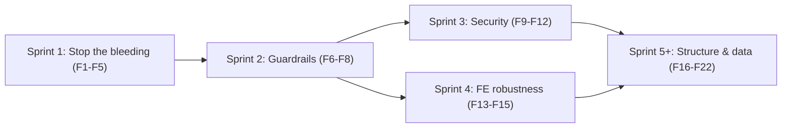

# OPS-OS Fixes Backlog & Game Plan

A concrete, itemized companion to [code-review-2026-07.md](code-review-2026-07.md).
That doc explains *why*; this one is the *what* and *in what order* — a checklist
you can work through and tick off.

Effort key: S = under half a day, M = about a day, L = multi-day.
Each item lists a severity, an effort, and a "done when" acceptance check.

---

## Sprint 1 — Stop the bleeding (Phase 0)

Goal: green build, working onboarding, one canonical repo. Nothing here is risky.

- [ ] F1 — Fix backend `tsc` build errors. Severity: High. Effort: M.
  - Add explicit types to the implicit-any parameters (mostly in `backend/src/services/workflow.ts`, plus `middleware/auth.ts`, `routes/maps.ts`, `routes/admin/users.ts`).
  - Fix the `string | string[]` query-param typing and the `AuthedRequest` cast in `routes/maps.ts` (~lines 550, 572, 598).
  - Confirm `prisma generate` output resolves the `RoleName` / `MapPhase` / `MapUpdateManyMutationInput` export errors.
  - Done when: `cd backend && npm run build` exits 0.
- [ ] F2 — Add `vitest` to `backend` and `frontend` devDependencies. Severity: High. Effort: S.
  - Done when: `cd backend && npm ci && npm test` and the same in `frontend` both pass without root hoisting.
- [ ] F3 — Add `backend/.env.example`. Severity: High. Effort: S.
  - Include every var the code reads (`DATABASE_URL`, `DIRECT_URL`, `JWT_SECRET`, `PORT`, `DEMO_MODE`, `GOOGLE_CLIENT_ID`, `CORS_ORIGINS`, `ALLOWED_EMAIL_DOMAINS`, Google Sheets vars) with placeholder values.
  - Done when: a fresh clone can follow the README and start the backend.
- [ ] F4 — Untrack build/env artifacts. Severity: High. Effort: S.
  - `git rm --cached frontend/.env frontend/tsconfig.tsbuildinfo`; add `*.tsbuildinfo` (and confirm `.env`) to `.gitignore`.
  - Done when: `git ls-files` shows neither file.
- [ ] F5 — Remove/relocate the stale `/Users/OPS-OS/OPS-OS` copy. Severity: Medium. Effort: S.
  - Kill any stray dev servers from it, archive or delete the folder, and add a "canonical path" note to the README.
  - Done when: only one repo on disk; `localhost:5173` / `:3001` can only resolve to this workspace.

## Sprint 2 — Guardrails (Phase 1)

Goal: the CI catches what humans miss, so regressions can't silently return.

- [ ] F6 — Add ESLint + Prettier (shared config, both packages). Severity: Medium. Effort: M.
  - Done when: `npm run lint` exists and passes (or reports only intentional debt).
- [ ] F7 — Extend CI: typecheck/build + lint for both packages, and enable on `main`. Severity: Medium. Effort: M.
  - Update `.github/workflows/test.yml` to run `npm run build` and lint; add `main` to the trigger branches.
  - Done when: a PR that breaks the build or lint fails CI.
- [ ] F8 — First backend route/auth tests. Severity: Medium. Effort: M.
  - Cover: demo login gating, Google login rejection paths, `requirePermissions`/`requireRoles` guards, and standard error shapes.
  - Done when: these run in CI (mock or test DB) and pass.

## Sprint 3 — Security hardening (Phase 2)

Goal: close the real access-control gaps.

- [ ] F9 — Decide and finish the permission model. Severity: High. Effort: L.
  - Either migrate route guards from `requireRoles` to `requirePermissions` across `maps.ts` / `availability.ts` / `reports.ts`, or explicitly keep role-only and document that overrides are admin-display-only. Align the admin route guard (`App.tsx`) and sidebar (`OpsManagerSidebar.tsx`) to the same choice.
  - Done when: UI gating and API enforcement use the same mechanism, verified by a test.
- [ ] F10 — Enforce email allowlist on every login. Severity: High. Effort: S.
  - In `routes/auth.ts`, apply the `ALLOWED_EMAIL_DOMAINS` check to existing users too, not just new signups; require it (or a safe default) in production.
  - Done when: a disallowed domain cannot authenticate even if the user already exists.
- [ ] F11 — Add rate limiting + `helmet`; scope CORS in production. Severity: Medium/High. Effort: M.
  - Rate-limit auth and bulk import/sync endpoints; add security headers; drop localhost CORS origins when `NODE_ENV=production`.
  - Done when: repeated auth attempts are throttled and security headers are present.
- [ ] F12 — Invalidate auth cache on admin mutations + tighten WS auth. Severity: Medium. Effort: S/M.
  - Call `invalidateUserCache(userId)` after role/permission PATCHes; re-resolve the user (not just verify the token) on WebSocket connect and avoid the token in the query string.
  - Done when: a role change takes effect immediately, and a revoked user can't hold a live socket.

## Sprint 4 — Frontend robustness (Phase 3)

Goal: failures are visible, data flow is consistent, UI is accessible.

- [ ] F13 — Surface `isError` on all dashboards and map queries. Severity: High. Effort: M.
  - Add an error banner + retry to Leader/Ops/Supervisor/Inspector dashboards and `MapDetailPage`.
  - Done when: a forced API failure shows an error state, not an empty board.
- [ ] F14 — Migrate remaining `useEffect` fetches to React Query. Severity: Medium. Effort: M.
  - `AdminUsersPage`, `OpsShiftPlanner` (use the existing `useShiftPlanQuery`), `PublishedSchedulePanel`, `ShiftChangePanel`, `SwapOffersPanel`.
  - Done when: no manual `load()` + `useState` fetch patterns remain in those files.
- [ ] F15 — Harden the shared `Modal` and hub drag-and-drop. Severity: Medium. Effort: M.
  - Add `role="dialog"`, focus trap, and Escape to `components/common/Modal.tsx`; add a keyboard alternative for `MapHubBoard` DnD.
  - Done when: modals trap focus/close on Esc and the hub is operable by keyboard.

## Sprint 5+ — Structure & data (Phases 4-5)

Goal: pay down the big structural and data debts once the above is stable.

- [ ] F16 — Split the 1000+ line boards and extract shared "maps board" primitives. Severity: Medium. Effort: L.
  - Targets: `MapHubBoard` (~1491), `OpsMapsBoard` (~1232), `AssignmentBoard` (~1206), `OpsShiftPlanner` (~1038).
- [ ] F17 — De-duplicate Inspector/QA dashboards. Severity: Low/Medium. Effort: M.
- [ ] F18 — Kill FE/BE type drift. Severity: Medium. Effort: L.
  - Introduce a shared source (codegen from Prisma, or a shared package) for `RoleName`, `Permission`, and labels so `frontend/src/lib/permissions.ts` and `types/core.ts` are not hand-maintained.
- [ ] F19 — Move attachments off base64/`Text`. Severity: Medium. Effort: L.
  - Store `MapAttachment` blobs in object storage; keep only a reference in the DB.
- [ ] F20 — Add missing indexes. Severity: Medium. Effort: S.
  - `User.shiftStartedAt` and `MapEvent.userId` (both queried by daily reports). Ship as a migration.
- [ ] F21 — Daily report: configurable timezone + regeneration. Severity: Medium. Effort: M.
  - Make the day boundary configurable (not server-local) and allow regenerating an existing report.
- [ ] F22 — Backend hygiene follow-ups. Severity: Low/Medium. Effort: M.
  - Global error handler + `asyncHandler`; consistent HTTP status codes; stop returning raw error messages; shared Zod schemas at the route boundary; begin extracting subdomains from `workflow.ts`.

---

## Sequencing at a glance

Rationale: Sprint 1 is a hard prerequisite (you cannot trust anything until the
build is green and there is one repo). Sprint 2 makes every later change safer.
Sprints 3 and 4 are independent and can run in parallel. Sprint 5+ is the
long-tail refactor and data work, best done last on a stable base.

## Suggested first PR

Bundle F2, F3, F4, F5 (all Small) into one low-risk "housekeeping" PR, then do F1
(the build fix) as its own focused PR so the diff is reviewable. After that, turn
on the CI build gate (F7) so the build can never silently break again.
