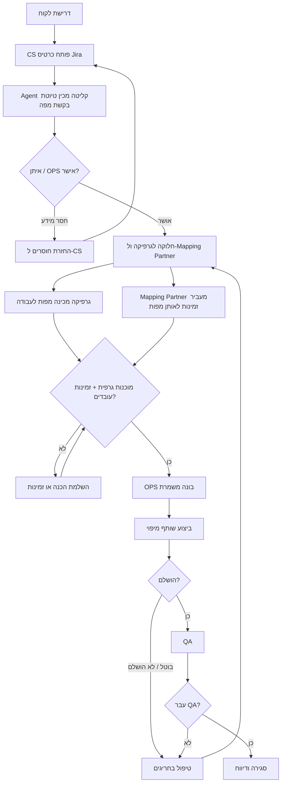

# OPS TOOL - הצעת זרימת דאטה אג'נטית ב-6 שלבים

## הרעיון המרכזי

הבעיה היא לא שחסר עוד Excel או עוד דשבורד. הבעיה היא שאין **זרימת דאטה אחת** שמגדירה לכל מפה:

- מה נכנס למערכת.
- איזו פעולה מתבצעת.
- מה יוצא מהפעולה.
- מי מאשר או מטפל בחריגה.

הפתרון המוצע: להפוך כל מפה ל־**רשומת עבודה אחת** שעוברת בין 6 שלבים ברורים. כל שינוי נרשם כ־אירוע, וכל Agent עובד על האירועים האלה: מזהה בעיות, מכין טיוטות, פותח משימות בטוחות, ומבקש אישור אנושי לפעולות רגישות.

## מודל בסיסי

### ישות מרכזית: מפה

כל המערכת סובבת סביב רשומת `Map` אחת:

| שדה | למה צריך אותו |
|---:|---:|
| מזהה מפה | מזהה יחיד למפה |
| לקוח / אזור | זיהוי עסקי ותפעולי |
| סטטוס נוכחי | מצב נוכחי אחד וברור |
| אחראי | מי אחראי כרגע |
| צוות משויך | OPS / מפקח / שותף מיפוי / גרפיקה / QA |
| תאריך יעד / SLA | מתי זה אמור להסתיים |
| סיבת חריגה | למה זה תקוע, בוטל או חזר אחורה |
| קבצים / קישורים | קבצים רלוונטיים |
| אירוע אחרון | הפעולה האחרונה שבוצעה |

### כל פעולה היא אירוע

במקום לעדכן כמה קבצים, כל צוות מוסיף אירוע:

| שדה | דוגמה |
|---:|---:|
| סוג אירוע | `created`, `scheduled`, `completed_mapping`, `cancelled`, `sent_to_graphics`, `qa_failed`, `closed` |
| מבצע | משתמש או Agent |
| זמן | זמן פעולה |
| מידע נכנס | מה התקבל |
| פעולה | מה קרה |
| מידע יוצא | מה השתנה |
| אישור | אוטומטי / דורש אישור / אושר ידנית |

זה נותן מקור אמת, היסטוריה, ודאטה שאפשר להריץ עליו Agents בלי לנחש.

## הזרימה מתוך המצגת

המצגת מתארת את הזרימה כך:

דרישת לקוח  
↓  
CS  
↓  
כרטיס Jira  
↓  
חלוקה לגרפיקה ול-Mapping Partner  
↓  
הכנת מפות לעבודה + זמינות עובדים  
↓  
OPS  
↓  
ניהול משמרות  
↓  
מיפוי / שותף מיפוי  
↓  
לולאת ביטול או אי-השלמה  
↓  
QA  
↓  
סגירה

הבעיה המרכזית היא שהזרימה קיימת בפועל, אבל הדאטה לא זורם כאובייקט אחד. במיוחד בשלב השני, יש עבודה שחייבת לקרות במקביל: גרפיקה צריכה להכין מפות, ובאותו זמן Mapping Partner צריך לתת זמינות עובדים לאותן מפות. בלי חיבור בין שני המסלולים האלה, OPS בונה משמרות על מידע חלקי.

## 6 שלבי זרימה מוצעים

| שלב | מידע נכנס | פעולה | מידע יוצא | AI אג'נטי |
|---:|---:|---:|---:|---:|
| 1. קליטת דרישת לקוח | דרישות לקוח שמגיעות מ-CS דרך כרטיס Jira | חילוץ הדרישה מהכרטיס, יצירת בקשת מפה, ובדיקת שדות חובה | בקשת מפה מובנית או רשימת חוסרים ל-CS | Agent קליטה מציע מילוי אוטומטי מ-Jira ומסמן חוסרים לפני שאדם מאשר |
| 2. הכנת מפות וזמינות שותף | מפות שנאספו מ-CS, דרישות הכנה, זמינות עובדים | גרפיקה מכינה מפות ובמקביל Mapping Partner מעביר זמינות לאותן מפות | מפות שעברו שער: מוכנות גרפית + זמינות עובדים | Agent הכנה וזמינות מציף מפות מוכנות בלי עובדים או עובדים בלי מפות מוכנות |
| 3. ניהול משמרות OPS | מפות מוכנות, זמינות עובדים, עדיפות, תאריך יעד | OPS בונה משמרת ומשייך מפות / עובדים / מפקח | משמרת מתוכננת לביצוע | Agent שיבוץ מציע טיוטת משמרת, אדם מאשר |
| 4. ביצוע מיפוי ודיווח שותף | משמרת מתוכננת, מפות משובצות, הוראות | ביצוע מיפוי או דיווח ביטול / אי-השלמה | סטטוס ביצוע, סיבת חריגה, קבצים / הערות | Agent שותף מיפוי בודק דיווח חסר ומבקש השלמה |
| 5. טיפול בחריגים | מפות שבוטלו, לא הושלמו, או חסרות מידע | פתיחת תור טיפול והחזרה לשלב המתאים | משימה ל-OPS עם סיבה, עדיפות והצעת פעולה | Agent טיפול בחריגים מציע אם לחזור להכנה, זמינות או שיבוץ |
| 6. QA, סגירה ודיווח | מפות שבוצעו, תוצאות QA, כל האירועים | בדיקה, סגירה, דוח סוף משמרת, מדדים | מפה סגורה, דוח, תובנות | Agent סוף משמרת מסכם; Agent תובנות OPS מזהה צווארי בקבוק |

## פירוק שלב 1: קליטת דרישת לקוח

הכאב הראשון היום:

CS מקבל דרישות מהלקוח, פותח כרטיס Jira, ואז איתן אוסף את המידע מהכרטיס ומסדר אותו מחדש בתוך Excel. זה יוצר צוואר בקבוק ידני כבר בתחילת התהליך: אם חסר שדה, אם המידע כתוב לא אחיד, או אם יש כמה כרטיסים דומים, הבעיה עוברת קדימה במקום להיתפס בכניסה.

### מידע נכנס

| מקור | דאטה |
|---:|---:|
| לקוח | דרישת מיפוי, אזור, תאריך יעד, עדיפות, קבצים או לינקים |
| CS | כרטיס Jira עם תיאור הדרישה והקשר עסקי |
| איתן / OPS | תיקונים ידניים, השלמות, תעדוף ראשוני |

### פעולה

במקום שאיתן יעתיק ידנית ל-Excel, המערכת יוצרת בקשת מפה מתוך כרטיס ה-Jira:

- קוראת שדות מובנים מ-Jira.
- מחלצת מידע מהתיאור החופשי.
- בודקת שדות חובה.
- מזהה כרטיס דומה או כפילות אפשרית.
- מסמנת מה חסר כדי להחזיר ל-CS.
- מאפשרת לאיתן לאשר או לתקן לפני יצירת מפה רשמית.

### מידע יוצא

| פלט | משמעות |
|---:|---:|
| בקשת מפה תקינה | דרישה תקינה שמוכנה לתכנון ושיבוץ |
| משימת השלמת מידע | משימה ל-CS להשלים מידע חסר |
| אזהרת כפילות | חשד לכפילות מול דרישה קיימת |
| אירוע קליטה בלוג | תיעוד מי אישר, מה שונה, ומה הגיע מה-Jira |

### AI אג'נטי בשלב הזה

Agent הקליטה לא אמור לפתוח מפות לבד בלי בקרה. הוא אמור להכין לאיתן טיוטה:

| יכולת | רמת אוטונומיה |
|---:|---:|
| חילוץ לקוח / אזור / תאריך יעד / עדיפות מ-Jira | טיוטה |
| סימון שדות חסרים | סיוע |
| זיהוי כפילות אפשרית | סיוע |
| יצירת בקשת מפה אחרי אישור איתן | אישור אנושי |
| שליחת בקשת השלמה ל-CS | טיוטה + אישור |

המדד להצלחה בשלב 1: איתן לא צריך לבנות Excel מחדש. הוא צריך לקבל תור של כרטיסי Jira שכבר הפכו לטיוטות בקשת מפה, לתקן רק חריגים, ולאשר כניסה לתהליך.

## הזרימה בפועל

## איפה AI אג'נטי באמת מוסיף ערך

### 1. Agent לא מחליף את המערכת

ה-Agent לא אמור להיות מקור האמת. מקור האמת הוא בסיס הנתונים ולוג האירועים.

ה-Agent רק:
- קורא אירועים.
- מזהה חריגים.
- מכין פעולה.
- מבצע רק פעולות בטוחות.
- מבקש אישור לפני פעולה רגישה.

### 2. Agents מומלצים ל-MVP

| Agent | למה להתחיל ממנו | רמת אוטונומיה |
|---:|---:|---:|
| Agent קליטה | מוריד מאיתן העתקה וסידור ידני מ-Jira ל-Excel | טיוטה + אישור |
| Agent הכנה וזמינות | מסנכרן בין הכנת גרפיקה לזמינות עובדים לפני ניהול משמרות | סיוע |
| Agent איכות דאטה | מונע דאטה מלוכלך כבר בכניסה | סיוע |
| Agent סוף משמרת | נותן ערך יומי מיידי ל-OPS | טיוטה |
| Agent טיפול בחריגים | מונע ממפות להיעלם אחרי ביטול | פעולה בטוחה + אישור |

### 3. פעולות שמותר לבצע אוטומטית

| פעולה | למה בטוח |
|---:|---:|
| פתיחת משימת המשך | לא משנה החלטה עסקית, רק מוודא טיפול |
| סימון "דורש בדיקה" | לא סוגר תהליך ולא משנה שיבוץ |
| יצירת טיוטת דוח | אדם מאשר לפני שליחה |
| הוספת הערה ללוג | משמר היסטוריה, לא משנה סטטוס סופי |

### 4. פעולות שחייבות אישור אנושי

| פעולה | סיבה |
|---:|---:|
| שינוי שיבוץ | משפיע על אנשים ולו"ז |
| ביטול מפה | החלטה תפעולית משמעותית |
| סגירת מפה | משפיע על KPI ודיווח |
| שליחת הודעה חיצונית | סיכון תקשורתי מול שותף / לקוח |
| שינוי הרשאות | סיכון אבטחה וניהול |

## ה-MVP הכי קטן שעובד

לא צריך להתחיל מכל המודולים. לפי ה-PPT והכאב הראשון, מספיק להתחיל מ־4 דברים:

1. **תור קליטה מ-Jira**
   - כל כרטיס Jira נכנס לתור אחד.
   - Agent הקליטה יוצר טיוטת בקשת מפה.
   - איתן / OPS מאשר לפני יצירת מפה.

2. **בסיס מפות + לוג אירועים**
   - רשומת מפה אחת.
   - סטטוסים אחידים.
   - אחראי אחד בכל רגע.
   - כל שינוי נרשם.
   - כל Agent כותב ללוג כמו משתמש רגיל.

3. **תור הכנה וזמינות**
   - גרפיקה מסמנת מפות מוכנות לעבודה.
   - Mapping Partner מזין זמינות עובדים.
   - OPS רואה רק מה שאפשר לשבץ באמת.

4. **תור OPS, ביצוע ודיווח**
   - OPS בונה משמרות מתוך מפות מוכנות וזמינות.
   - שותף מיפוי מדווח הושלם / בוטל / לא הושלם.
   - QA ודוח סוף משמרת נבנים מהאירועים.

## למה זו הצעה טובה יותר

| הגישה הישנה | הגישה המוצעת |
|---:|---:|
| כמה קבצי Excel | מקור אמת אחד |
| עדכונים ידניים בכמה מקומות | אירוע אחד שמשתקף בכל התצוגות |
| OPS מחפש בעיות | Agents מציפים חריגים |
| דוחות סוף משמרת ידניים | טיוטת דוח אוטומטית |
| ביטולים נופלים בין הכיסאות | תור חריגים עם משימת המשך |
| AI כ"פיצ'ר" | AI כשכבת פעולה ובקרה מעל דאטה מסודר |

## משפט מסכם ל-VP Product

במקום לבנות עוד כלי שמציג את אותו בלגן בצורה יפה יותר, אנחנו מציעים לבנות **זרימת דאטה תפעולית אחת**: כל מפה היא רשומה אחת, כל שינוי הוא אירוע, וכל Agent מקבל הרשאה מוגבלת לעזור לפי שלב. כך AI לא מחליף את OPS, אלא הופך אותו מצוות שמחפש בעיות לצוות שמאשר, מתעדף וסוגר טיפול.

