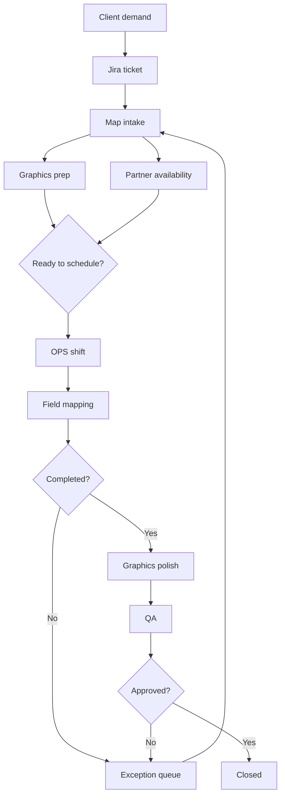

# OPS Process Overview

High-level vision for how OPS-OS fits into end-to-end mapping operations. The full Hebrew product spec lives in the repo at `docs/ops-processes/overview.md`.

## The core problem

The issue is not missing dashboards — it is the lack of a **single data flow** per map:

- What enters the system
- What action is taken
- What leaves the action
- Who approves or handles exceptions

Today this information is spread across Excel files, chats, and end-of-shift reports.

## The proposed model

### One map record

Everything revolves around a single `Map` entity:

| Field | Purpose |
|-------|---------|
| Map ID | Unique identifier |
| Client / area | Business and operational context |
| Current status | One clear state |
| Owner | Who is responsible right now |
| Assigned teams | OPS, inspector, mapping partner, graphics, QA |
| Due date / SLA | When it should finish |
| Exception reason | Why it is stuck, cancelled, or rolled back |
| Files / links | Relevant assets |
| Last event | Most recent action |

### Every action is an event

Instead of updating multiple spreadsheets, each team appends an event with type, actor, timestamp, input, action, output, and approval level. This gives OPS-OS its audit log and future agent layer a consistent data source.

## Six operational stages

| Stage | Input | Action | Output | Agent opportunity |
|-------|-------|--------|--------|-------------------|
| **1. Client demand intake** | Jira ticket from CS | Extract requirements, validate fields | Structured map request or gap list | Draft intake from Jira |
| **2. Map prep & partner availability** | Maps from CS, worker availability | Graphics prepares; partner declares availability | Maps ready for scheduling | Flag maps without workers / workers without maps |
| **3. OPS shift management** | Ready maps, availability, priorities | OPS builds shift, assigns maps/people | Planned shift | Draft shift proposal |
| **4. Mapping execution & partner report** | Planned shift, assigned maps | Field mapping or cancel/incomplete report | Execution status, exceptions | Chase missing partner reports |
| **5. Exception recovery** | Cancelled / incomplete maps | Route back to correct stage | OPS task with reason and priority | Suggest reroute target |
| **6. QA, close & reporting** | Completed maps, QA results | Review, close, end-of-shift report | Closed map, metrics | Auto-draft shift summary |

## What OPS-OS implements today

| Stage | MVP status |
|-------|------------|
| 1 — Intake | Partial — Jira stub + CSV import (no real webhook) |
| 2 — Prep & availability | Partial — graphics prep + supervisor availability |
| 3 — Shift management | Partial — shift planner and roster |
| 4 — Field execution | Partial — supervisor field updates, hub board |
| 5 — Exceptions | Early — cancel / incomplete fields, return visits |
| 6 — QA & reporting | Partial — QA workflow + end-of-shift reports |

## Process flow (simplified)

## Agent design principles

Agents are **not** the source of truth — the database and event log are.

Agents should:

- Read events and flag anomalies
- Draft actions for human approval
- Execute only safe, reversible operations
- Require approval for scheduling changes, cancellations, closures, and external messages

### Recommended MVP agents

| Agent | Value | Autonomy |
|-------|-------|----------|
| Intake agent | Remove manual Jira → Excel copying | Draft + human approve |
| Prep & availability agent | Sync graphics readiness with worker availability | Assist |
| Data quality agent | Catch missing fields at intake | Assist |
| End-of-shift agent | Auto-draft daily summary | Draft |
| Exception agent | Prevent maps falling through cracks | Safe action + approve |

## Detailed stage docs (in repo)

| Doc | Topic |
|-----|-------|
| `docs/ops-processes/01-client-demand-intake.md` | Stage 1 |
| `docs/ops-processes/02-map-preparation-and-partner-availability.md` | Stage 2 |
| `docs/ops-processes/03-ops-shift-management.md` | Stage 3 |
| `docs/ops-processes/04-mapping-execution-partner-report.md` | Stage 4 |
| `docs/ops-processes/05-exception-recovery.md` | Stage 5 |
| `docs/ops-processes/06-qa-close-reporting.md` | Stage 6 |

## See also

- [[Map Lifecycle]] — implemented phase model in the app
- [[Roadmap]] — what is planned next
- [Product analysis (repo)](https://github.com/Roiatia/OPS-OS/blob/main/docs/OPS_TOOL_ANALYSIS.md)
